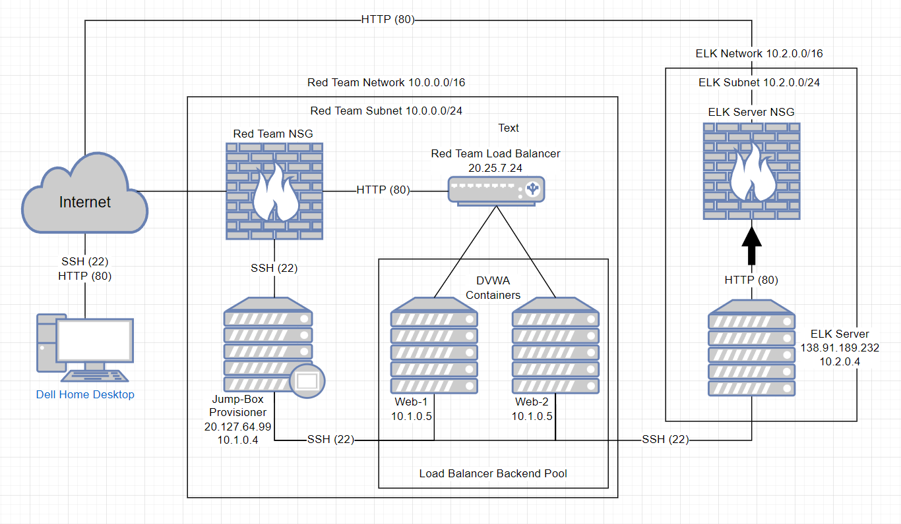
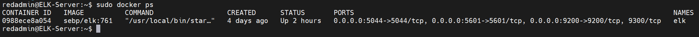
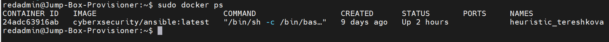

## Automated ELK Stack Deployment 

The files in this repository were used to configure the network depicted below.

 

These files have been tested and used to generate a live ELK deployment on Azure. They can be used to either recreate the entire deployment pictured above. Alternatively, select portions of the respective playbook file may be used to install only certain pieces of it, such as Filebeat.

- [filebeat-config.yml](Ansible/filebeat-config.ymlansible_config.yml)
- [filebeat-playbook.yml](Ansible/filebeat-playbook.yml)
- [metricbeat-configuration.yml](Ansible/metricbeat-configuration.yml)
- [metricbeat-playbook.yml](Ansible/metricbeat-playbook.yml)

 

## This document contains the following details:
- Description of the Topologu
- Access Policies
- ELK Configuration
  - Beats in Use
  - Machines Being Monitored
- How to Use the Ansible Build

 

### Description of the Topology

The main purpose of this network is to expose a load-balanced and monitored instance of DVWA, the D*mn Vulnerable Web Application.

Load balancing ensures that the application will be highly available, in addition to restricting access to the network. The jump box in this setup provides one point of entry and exit giving a choke point for securing and configuring the internal network from the external network (generic internet).

Integrating an ELK server allows users to easily monitor the vulnerable VMs for changes to the network and system configuration.

The configuration details of each machine may be found below.

| Name       | Function                   | IP Address | Operating System     |
|------------|----------------------------|------------|----------------------|
| Jump Box   | Gateway                    | 10.1.0.4   | Linux (ubuntu 18.04) |
| Web-1      | Traffic Monitoring         | 10.1.0.5   | Linux (ubuntu 18.04) |
| Web-2      | Traffic Monitoring         | 10.1.0.5   | Linux (ubuntu 18.04) |
| ELK Server | Data Analytics Generation  | 10.2.0.4   | Linux (ubuntu 18.04) |

 

## Access Policies

The machines on the internal network are not exposed to the public Internet. 

Only the Jump Box / Provisioner machine can accept connections from the Internet. Access to this machine is only allowed from the whitelsted public realworld IP address for the administrator through SSH (port 22).

Machines within the network can only be accessed by Jump Box / Provisioner within its cooresponding ansible container @ 10.1.0.4.

A summary of the access policies in place can be found in the table below:

| Name       | Publicly Accessible | Allowed IP Addresses    |
|------------|---------------------|-------------------------|
| Jump Box   | Yes                 | SSH from Whitelisted IP |
| Web-1      | No                  |                         |
| Web-2      | No                  |                         |
| ELK Server | Yes                 | SSH from Whitelisted IP |

 

## Elk Configuration

Ansible was used to automate configuration of the ELK machine. No configuration was performed manually, which is advantageous because this reduces deployment time per container, allows for scalable deployment and eliminates manual configuration entry errors.

The playbook implements the following tasks:
- Intalls the following modules within the container: docker.io, pip3, Install Docker python module 
- Configures sysctl modules 
- Sets the docker services to boot on docker start

 
The following screenshot displays the result of running "docker ps" after successfully configuring the ELK instance.

 

Here is the Ansible docker as well

 

## Target Machines & Beats
This ELK server is configured to monitor the following machines:
-Web-1: 10.1.0.5
-Web-2: 10.1.0.6

We have installed the following Beats on these machines:
- Filebeats version 7.6.2
- Metricbeats version 7.6.2

These Beats allow us to collect the following information from each machine:
- Filebeats - a lightweight way to forward and centralize logs and files
- Metricbeats - a lightweight way to send system and service statistics

 

## Using the Playbook
In order to use the playbook, you will need to have an Ansible control node already configured. Assuming you have such a control node provisioned: 

SSH into the control node and follow the steps below:
- Copy the filebeat.configuration & metricbeat.config file to the ansible container in /etc/Ansible/roles directory

- Update the configuration files to include correct IP addresses of the local IP addresses for the Elk Server @ 10.2.04:5601 and 10.2.0.4:9200.

- Run the filebeat and metricbeat playbooks, and navigate to the proper URL of the ELK server GUI (Kibana http://
138.91.189.232:5601/app/kibana#/home) to check that the installation worked as expected.

The two playbook files you will need to be concerned with is filebeat-playbook.yml & metricbeat-playbook.yml, both of these will need to be copied to the /etc/ansible/roles directory on your ansible container on the jump box provisioner.

You will need to update filebeat-config.yml & metricbeat-configuration.yml specifically on lines 1106 and 1806 and add the ELK private IP address of 10.2.0.4 so that the deployment of the Kibana monitor modules are deployed properly on the ELK server.

 

### Line 1106 - update the hosts IP address to your ELK servers private IP
hosts: ["10.2.0.4:9200"] 
username: "elastic" 
password: "changeme" # (Change this to the password you set) 

 

### Line 1806 - perform the same action as above
setup.kibana: 
  host: "10.2.0.4:5601" # (Change this to the IP address of your ELK server)

 

You will also need to update the hosts file in the ansible container to show proper targets for deployment and monitoring for the ELK server 

 

[webservers] 
10.1.0.5 ansible_python_interpreter=/usr/bin/python3  
10.1.0.6 ansible_python_interpreter=/usr/bin/python3

[elk]
10.2.0.4 ansible_python_interpreter=/usr/bin/python3

 

Once all of the configurations have been set run the follwing commands from the ansible container:

 

ansible-playbook filebeat-playbook.yml 
ansible-playbook metricbeat-playbook.yml

 

If the deployment has run sucessfully you should be able to head to http://138.91.189.232:5601/app/kibana#/home and Kibana should come up in your web browser.